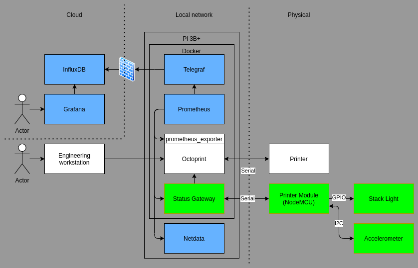

# printer-monitoring

**NOTE: this is not a safety system!**

This project was designed to assist 3d printer operators with managing their printers. By leveraging the position of additive manufacturing equipment on the cloud edge, we can build an optimized error detection flow, with a safe internet connected engineering workflow as secondary objective.

## System description

The system consists of multiple parts, shown in the following diagram.

The green blocks represent the custom hardware and necessary software that is added to the printer. These can function without direct user interaction by querying data from OctoPrint. They are directly useful to the operator in the machines physical vicinity.

The blue blocks are responsible for providing the operator with detailed metrics and logs regarding the health of the equipment.

## Stack light

The stack light provides the operator with data regarding the system state. The meaning of the different colors and patterns is as follows.

| color  | behaviour | meaning             |
| ------ | --------- | ------------------- |
| red    | solid     | error               |
| orange | blinking  | connectivity issues |
| orange | solid     | not ready           |
| green  | blinking  | warming up          |
| green  | solid     | printing            |
| white  | blinking  | waiting             |
| white  | solid     | idle                |
