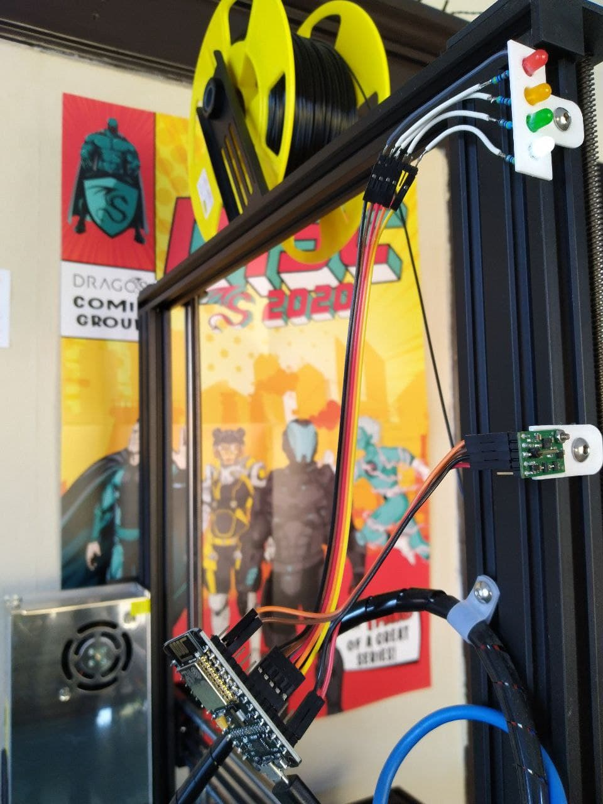

# printer-monitoring: printer-module

For the printer module, any modern microcontroller can be used. It has been tested with a NodeMCU Amica. Requirements are that the Pi can talk to it over serial, that it can communicate with the accelerometer over I2C and that it can drive the 4 LEDs.

Pinout is described in `src/main.cpp`.

For the accelerometer, the MinIMU-9 was used: <https://www.pololu.com/product/2738>

